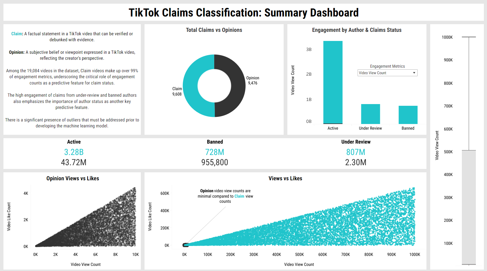

# TikTok Claims Classification: Summary Dashboard

[*Explore the Tableau Dashboard*](https://public.tableau.com/app/profile/dane.tipene/viz/TikTokClaimsClassificationSummaryDashboard/FullSummary2)

This Tableau summary dashboard provides a comprehensive overview of the key insights derived from the Exploratory Data Analysis (EDA) conducted on the TikTok dataset. The dashboard highlights the critical role of engagement metrics and author status in predicting whether a video is classified as a claim or opinion. 

Through visualizations such as scatter plots, doughnut charts, bar charts, and boxplots, the dashboard tells a data-driven story about the dominance of claim videos in terms of engagement and the significant influence of outliers. This tool serves as a valuable resource for understanding the underlying patterns and informing the development of a robust machine learning model.

 

