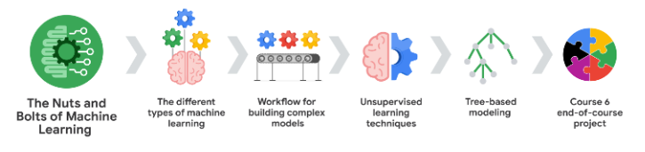

# Coming Soon!!

As part of the Advanced Google Data Analytics Professional Certificate, I am now delving into machine learning techniques and their applications in solving business problems. Through the 'Machine Learning for Advanced Data Analytics' course (Course 6), I am focusing on supervised and unsupervised learning methods, tree-based modeling, and ethical considerations in machine learning. This journey builds on my foundation in regression analysis and hypothesis testing, advancing toward more complex modeling techniques.

## Here's a brief overview of what I'm currently learning:

* ***Introduction to Machine Learning:*** Exploring the types of machine learning, focusing on supervised and unsupervised methods, understanding categorical vs. continuous variables, and analyzing recommendation systems. Ethical considerations and best practices are also covered.

* ***Machine Learning Workflow:*** Learning the end-to-end process of building machine learning models, from defining business problems to evaluating model performance. Emphasis on preparatory steps for successful implementation.

* ***Unsupervised Learning:*** Building K-means clustering models and understanding other clustering techniques. Comparing when to apply unsupervised vs. supervised learning models.

* ***Tree-Based Supervised Learning:*** Exploring advanced techniques like decision trees, random forests, adaptive boosting, and gradient boosting. Learning hyperparameter tuning for optimizing model performance.

* ***End-of-Course Project:*** Using all the skills and concepts learned to solve a business problem in a final project that will demonstrate my advanced data analytics capabilities. 

 

Upon completion of this course, I will update this repository with insights from the end-of-course project, showcasing my application of machine learning models and advanced statistical techniques.
