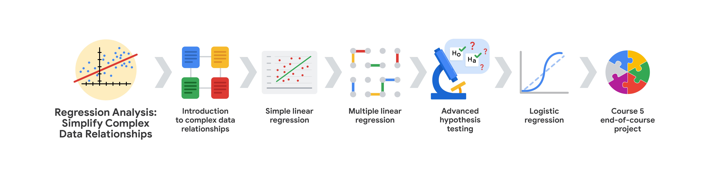

# Coming Soon!!

As part of the Advanced Google Data Analytics Professional Certificate, I am currently exploring more advanced concepts in data analysis through The 'Regression Analysis: Simplify Complex Data Relationships' in Course 5. My learning journey continues with a focus on regression techniques, hypothesis testing, and advanced statistical modeling.

## Here's a brief overview of what I'm currently learning:

* ***Introduction to Complex Data Relationships:*** Examining foundational concepts for regression analysis and understanding when to apply linear vs. logistic regression.

* ***Simple Linear Regression:*** Building and evaluating models in Python, with a focus on assumptions such as linearity, residual normality, and independent observations. Understanding R squared, confidence intervals, and p-values.

* ***Multiple Linear Regression:*** Extending simple regression to multiple variables, testing assumptions, and overcoming overfitting with regularization techniques.

* ***Advanced Hypothesis Testing:*** Applying various hypothesis tests such as Chi-squared, ANOVA, ANCOVA, and MANOVA to real-world problems.

* ***Logistic Regression:*** Exploring binomial and multinomial logistic regression models, along with key metrics like ROC, AUC, precision, and recall.

* ***End-of-Course Project:*** Using all the skills and concepts learned to solve a business problem in a final project that will demonstrate my advanced data analytics capabilities. 

 

Upon completion of this course, I will update this repository with insights from the end-of-course project, showcasing my application of regression models and advanced statistical techniques.
